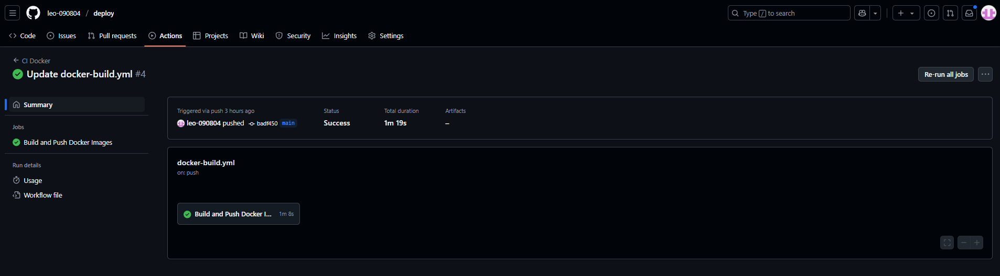
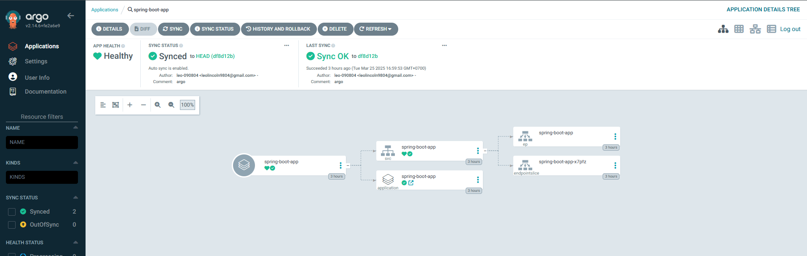

# Spring Applications on Kubernetes with GitHub Actions and ArgoCD

This repository demonstrates a complete CI/CD pipeline for Spring Boot applications using GitHub Actions for CI and ArgoCD for GitOps-based continuous deployment on Kubernetes.

## Architecture

- **GitHub Actions**: Automates building, testing, and pushing Docker images
- **ArgoCD**: Handles GitOps-based deployment to Kubernetes
- **Applications**:
  - `hello-spring-k8s`: Simple Spring Boot API service
  - `hello-caller`: Service that calls the hello-spring-k8s service

## Prerequisites

- GitHub account
- Kubernetes cluster (Cloud provider, Minikube, or Docker Desktop)
- kubectl configured to connect to your cluster
- Docker Hub account
- ArgoCD installed on your Kubernetes cluster

## Setup Instructions

### 1. Fork and Clone the Repository

```bash
git clone https://github.com/yourusername/top-spring-on-kubernetes.git
cd top-spring-on-kubernetes
```

### 2. Setting up GitHub Actions Secrets

In your GitHub repository:

1. Go to **Settings** > **Secrets and variables** > **Actions**
2. Add the following secrets:
   - `DOCKERHUB_USERNAME`: Your Docker Hub username
   - `DOCKERHUB_PASSWORD`: Your Docker Hub password or access token

### 3. Understanding the GitHub Actions Workflow

The workflow in `.github/workflows/docker-build.yml` automatically:
- Builds Spring Boot applications
- Creates Docker images
- Pushes images to Docker Hub

The workflow triggers on:
- Push to main branch
- Pull requests to main branch



### 4. Installing ArgoCD

```bash
# Create ArgoCD namespace
kubectl create namespace argocd

# Install ArgoCD
kubectl apply -n argocd -f https://raw.githubusercontent.com/argoproj/argo-cd/stable/manifests/install.yaml

# Access ArgoCD UI (in a new terminal)
kubectl port-forward svc/argocd-server -n argocd 8080:443
```

Access ArgoCD UI at [https://localhost:8080](https://localhost:8080)

Default credentials:
- Username: admin
- Password: Get by running: `kubectl -n argocd get secret argocd-initial-admin-secret -o jsonpath="{.data.password}" | base64 -d`

### 5. Configuring ArgoCD to Deploy Your Application

Using ArgoCD UI:

1. Add your Git repository
   - Click **+ New App**
   - Fill in the following:
     - Application Name: `hello-apps`
     - Project: `default`
     - Sync Policy: `Automatic`
     - Repository URL: Your GitHub repo URL
     - Path: `k8s` (where Kubernetes manifests are stored)
     - Cluster URL: `https://kubernetes.default.svc`
     - Namespace: `default`

Alternatively, apply the ArgoCD Application manifest:

```bash
kubectl apply -f argocd/applications/hello-apps.yaml
```

### 6. Deploying with GitOps Flow

Now your CI/CD pipeline is complete:

1. Push changes to your GitHub repository
2. GitHub Actions builds and pushes new Docker images
3. ArgoCD detects changes in Git and updates the deployment in Kubernetes

## Understanding the CI/CD Pipeline

### GitHub Actions CI Pipeline

The workflow `.github/workflows/docker-build.yml` contains these key steps:

```yaml
# Excerpt from workflow
jobs:
  build:
    steps:
      - name: Checkout source code
        uses: actions/checkout@v4
        
      # ... Build Java applications ...
      
      - name: Build and push Docker images
        uses: docker/build-push-action@v5
        with:
          push: true
          tags: ${{ secrets.DOCKERHUB_USERNAME }}/hello-spring-k8s:latest
```

### ArgoCD CD Pipeline

The application in `argocd/applications/hello-apps.yaml` configures continuous deployment:

```yaml
# Excerpt from ArgoCD application
spec:
  source:
    repoURL: https://github.com/leo-090804/deploy.git
    targetRevision: HEAD
    path: k8s
  syncPolicy:
    automated:
      prune: true
      selfHeal: true
```


