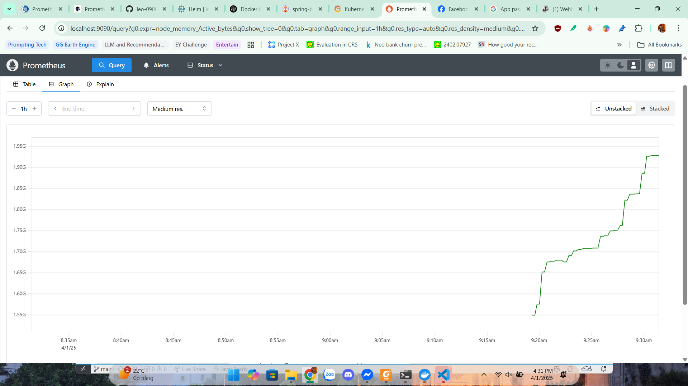
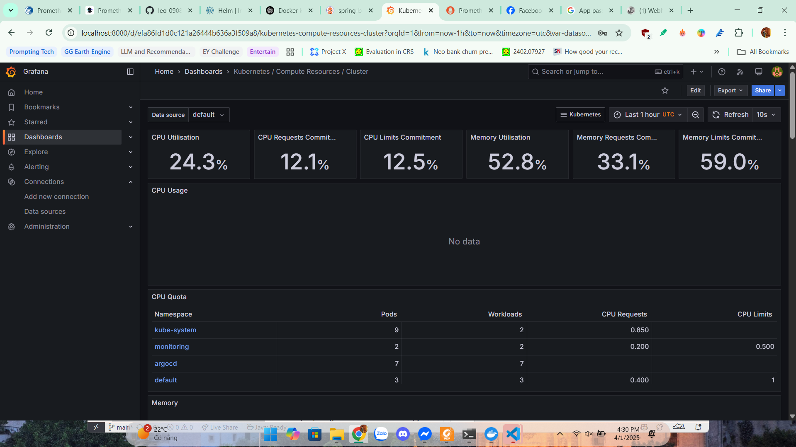
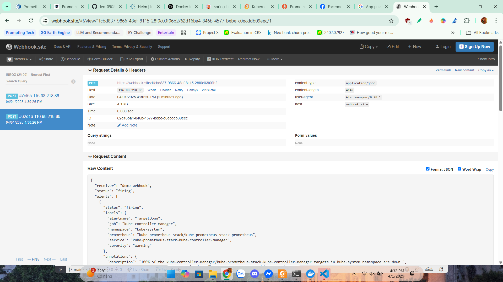
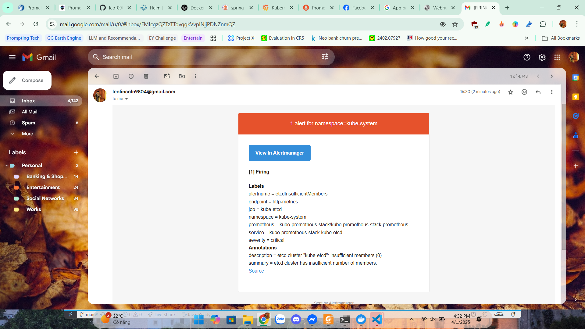

# Monitoring Spring Boot on Kubernetes with Prometheus, Grafana, and Alertmanager

## 1. Introduction
How to set up a monitoring system for Spring Boot applications running on Kubernetes using Prometheus, Grafana, and Alertmanager.

## 2. Installing kube-prometheus-stack

### 2.1. Add Helm repo and update
```bash
helm repo add prometheus-community https://prometheus-community.github.io/helm-charts
helm repo update
```

### 2.2. Install kube-prometheus-stack
```bash
helm install kube-prometheus-stack prometheus-community/kube-prometheus-stack -n kube-prometheus-stack --create-namespace
```

## 3. Accessing monitoring services

### 3.1. Prometheus (Port 9090)
```bash
kubectl port-forward svc/kube-prometheus-stack-prometheus -n kube-prometheus-stack 9090:9090
```
Open browser and access: [http://localhost:9090](http://localhost:9090)

**Result:**


### 3.2. Grafana (Port 8080)
```bash
kubectl port-forward svc/kube-prometheus-stack-grafana -n kube-prometheus-stack 8080:80
```
Log in to Grafana with:
- Username: `admin`
- Password: Get with command:
```bash
kubectl get secret --namespace kube-prometheus-stack kube-prometheus-stack-grafana -o jsonpath="{.data.admin-password}" | base64 --decode
```

Open browser and access: [http://localhost:8080](http://localhost:8080)

**Result:**


### 3.3. Alertmanager (Port 9093)
```bash
kubectl port-forward svc/kube-prometheus-stack-alertmanager -n kube-prometheus-stack 9090:9090
```
Open browser and access: [http://localhost:9090](http://localhost:9090)

**Result:**


## 4. Configure Alertmanager to send alerts via Webhook and Email

### 4.1. Edit configuration file `alertmanager.yaml`
```yaml
alertmanager:
  config:
    global:
      resolve_timeout: 5m
      smtp_smarthost: 'smtp.gmail.com:587'  # Replace with your SMTP server
      smtp_from: 'leolincoln9804@gmail.com'  # Sender email
      smtp_auth_username: 'leolincoln9804@gmail.com'
      smtp_auth_password: 'gagmobxjmcjrbmna'  # Use an app password if needed
      smtp_require_tls: true  # Ensure TLS security

    route:
      receiver: demo-webhook
      group_wait: 5s
      group_interval: 10s
      repeat_interval: 1h
      routes:
        - receiver: email-notifications
          match:
            severity: critical  # Only send critical alerts to email

    receivers:
      - name: "null"
      - name: demo-webhook
        webhook_configs:
          - url: "https://webhook.site/1fcbd837-9866-48ef-8115-28f0c03f06b2"
            send_resolved: true
      - name: email-notifications
        email_configs:
          - to: 'leolincoln9804@gmail.com'  # Replace with the actual recipient
            send_resolved: true
```

### 4.2. Apply configuration with Helm
```bash
helm upgrade kube-prometheus-stack prometheus-community/kube-prometheus-stack \
  --reuse-values -f alertmanager.yaml -n kube-prometheus-stack
```

### 4.3. Test sending Alerts
#### Send Alert to Webhook
```bash
curl -H 'Content-Type: application/json' -d '[{"labels":{"alertname":"alert-demo","namespace":"demo","service":"demo"}}]' http://127.0.0.1:9093/api/v2/alerts
```

#### Send Alert to Email
```bash
curl -H 'Content-Type: application/json' -d '[
  {
    "labels": {
      "alertname": "TestEmailAlert",
      "severity": "critical"
    }
  }
]' http://127.0.0.1:9093/api/v2/alerts
```

### 4.4. Result
- **Alert sent to email**
  